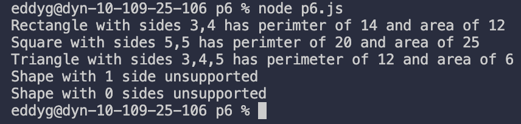

## File Overview:

- p6.js: A main Shape class with a Rectangle and Triangle class that extend into it. Uses a switch statement to determine which "shape" constructor to use to properly calculate area and perimeter.

  
_-
