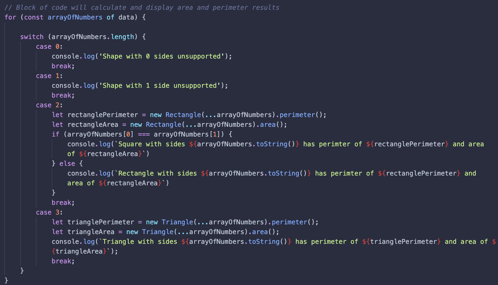

## File Overview:

- p6.js: A main Shape class with a Rectangle and Triangle class that extend into it. Uses a switch statement to determine which "shape" constructor to use to properly calculate area and perimeter.

  
_-The arrangment of the switch statement to call the proper functions_

 
 
_-Displays the output from after iterating through the data array_
